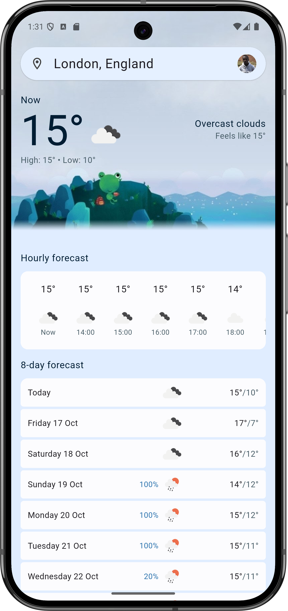
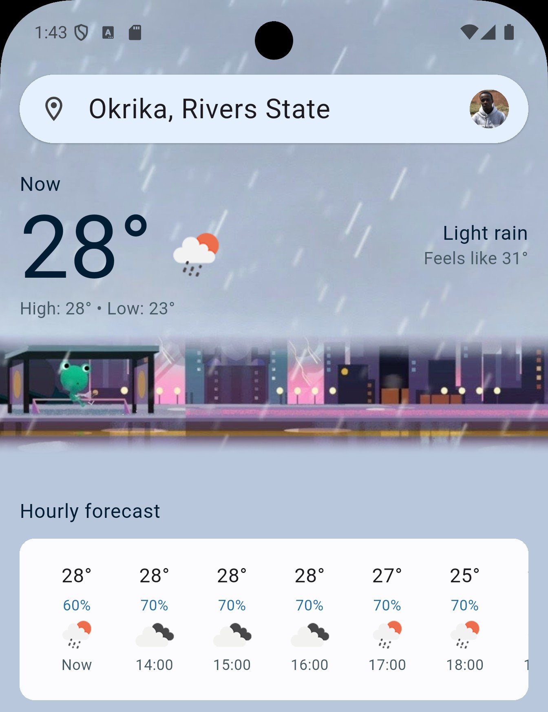
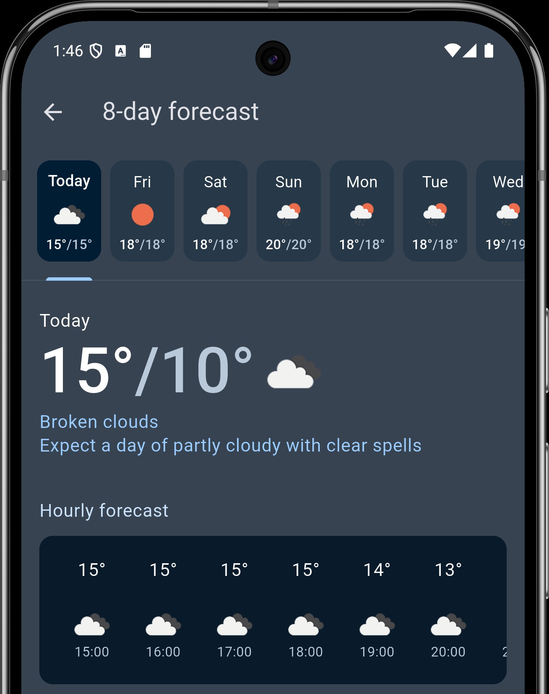
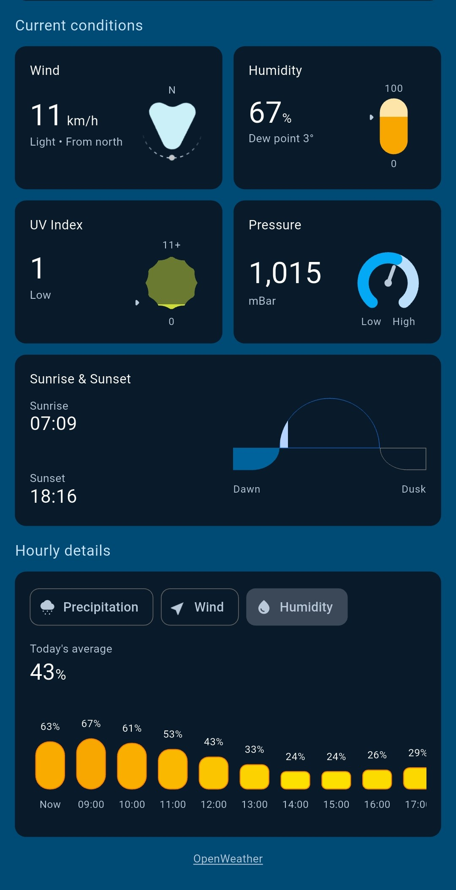
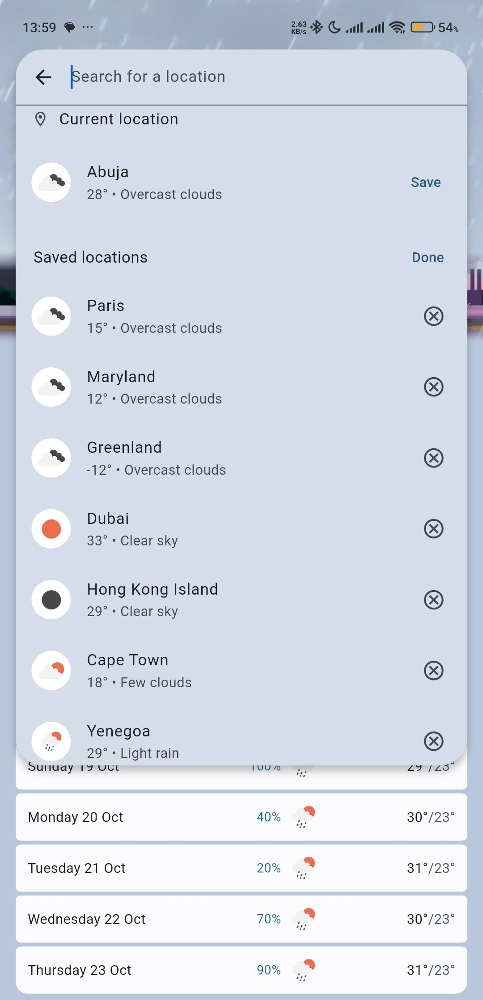
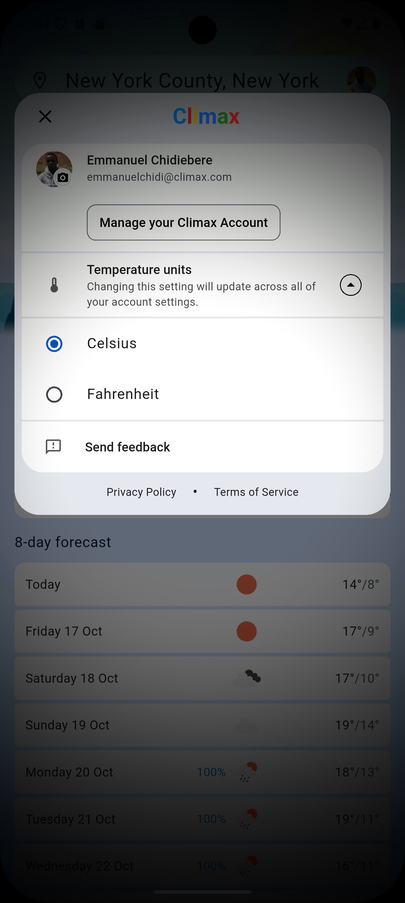

# 🌦️ Climax — Flutter Weather App

Climax is a beautifully designed weather app built with Flutter, delivering real-time weather updates using the OpenWeather API. Whether you're planning your day or chasing storms, Climax gives you accurate forecasts with a sleek, responsive interface.

## 📱 Features

- 🌍 Global weather data powered by OpenWeather
- 📍 Location-based forecasts with geolocation support
- 🌡️ Temperature, humidity, wind speed, and pressure
- 🎨 Dynamic UI that adapts to weather conditions
- ⚡ Fast performance across Android and iOS

## 🛠️ Tech Stack
- Flutter — Cross-platform mobile framework
- Dart — Clean, reactive programming language
- OpenWeather API — Reliable weather data source

## 🚀 Getting Started
To run Climax locally:
<pre>```bash
git clone https://github.com/your-username/climax.git
cd climax
flutter pub get
flutter run```</pre>

Make sure you’ve added your OpenWeather API key in the appropriate config file.

## 📸 Screenshots
<table>
  <tr>
    <td align="center" width="33%" valign="bottom">
      <hr/><em>Track rain probabilities and temperature trends at a glance</em>
    </td>
    <td align="center" width="33%" valign="bottom">
      <hr/><em>Live visuals that reflect current conditions</em>
    </td>
    <td align="center" width="33%" valign="bottom">
      <hr/><em>Plan ahead with detailed daily and hourly insights</em></td>
  </tr>
  <tr>
    <td align="center" width="33%" valign="bottom">
      <hr/><em>Monitor wind, humidity, UV index, and daylight hours in real time</em>
    </td>
    <td align="center" width="33%" valign="bottom">
      <hr/><em>Instantly compare conditions across global favorites. 8 Cities in one view</em>
    </td>
    <td align="center" width="33%" valign="bottom">
      <hr/><em>Manage your Climax account and switch between Celsius and Fahrenheit effortlessly</em></td>
  </tr>
</table>

## 📄 License
This project is licensed under the MIT License. See the LICENSE file for details.
